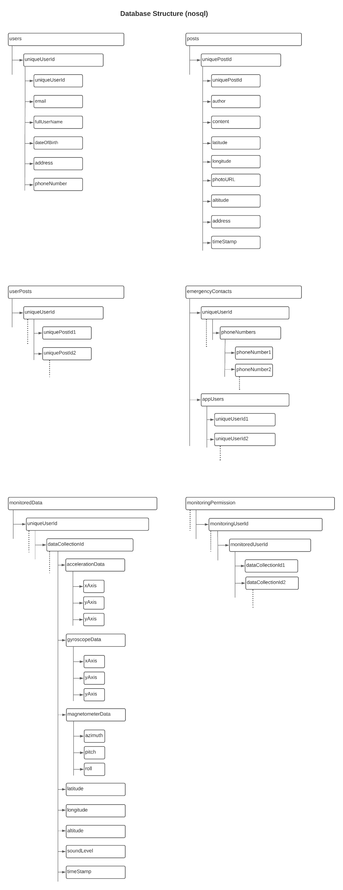

# Documentation

project proposal pdf, use cases/extended use cases document, links to apis etc are to be added here.  

## Use Cases

link - <https://lucid.app/lucidchart/invitations/accept/402a9747-2f5c-4ae1-bbb9-7d1965e45d2b>

  

## Database Structure- Nosql JSON  

  

## Changes in initial features  

- Nearby Connections API not acting expectedly, Reaching nearby users and all its corresponding features is put to hold for the time being.

- Emergency contacts need to be added by either phone number or username(first part of signup email) separately. Because phone number verification is not done in the app, phone number provided at the signup will only be used in sending the distress SMS.
